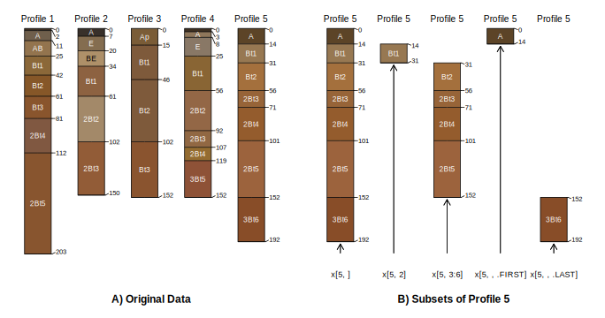
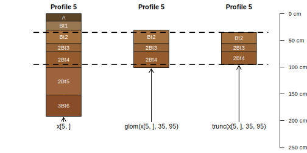

<!-- think about a less-jargony title -->

## Representing Collections of Soil Profiles in R

The `SoilProfileCollection` (SPC) is a data structure designed to coordinate linkages between elements within the typically complex (hierarchical) site description, soil morphologic description, and optionally laboratory data. Methods (data structure-specific functions) operating on the SPC include special constraints to ensure linkages aren't broken during routing operations such as editing, sub-setting, or combining collections. The first level of abstraction involves two main tiers: "site" for above-ground or those properties that are specific to a single soil profile description (e.g. surface slope), and "horizon" for below-ground or those properties that are specific to a single genetic soil horizon or layer. An additional level of abstraction is used to store spatial data (coordinates and coordinate reference system) and depth-intervals information such as diagnostic horizons. The SPC provides a means of storing user-defined metadata such as units of measure, column containing horizon designation, data source, and data citation to name a few. It is worth mentioning that the `SoilProfileCollection` object was designed with data analysis in mind; as compared to other (more complex) data structures used for archival purposes, such as those used within the USDA-NRCS National Soil Information System (NASIS).

Of primary importance are the horizon data, or the layers that comprise the profiles in the collection. The `SoilProfileCollection` is "horizon data forward," in that you start with a table of horizon data: each record must have an upper and lower boundary, a unique ID linking to a single soil profile observation, and any other observed or measured properties. There are no set limits on the number of horizons per profile, or profiles per collection, but, available memory will dictate practical limitations. Horizon depths should be specified as integers (typically centimeters) and should not overlap.

A `SoilProfileCollection` is created through "promotion" of an *R* `data.frame` (or `data.frame`-like object such as `tibble` or `data.table`) with the `depths()` function. This process requires the following parameters: `profile_id` (the name of a column containing unique profile IDs), `top_depth` (the name of a column containing horizon upper depths) and `bottom_depth` (the name of a column containing horizon lower depths) along with any additional horizon data associated with the horizons in the profile. For example, the promotion of a `data.frame` called `x` to `SoilProfileCollection` would follow: `depths(x) <- profile_id ~ top_depth + bottom_depth`.

In the *R* language, the symbol `~` separates the left and right hand sides of a formula. Commonly `~` is used in formulas to mean "modeled as". In the case of the `SoilProfileCollection` we are "modeling" the geometry and ordering of horizons within each unique profile using the upper and lower depths. Performing this operation automatically sorts horizon data first by profile ID and then by horizons top depth. 

The `site() <-` method is used to move site-level data from horizon-level records (necessary when starting with a mixture of horizon and replicated site data in the same table), or to merge a new table of site-level data via common ID and left join (missing records in the new table are filled with `NA`). In a similar manner, the `horizons() <-` method is used to merge a new table of horizon-level data into the `SoilProfileCollection` object via common ID (unique to specific horizons) and left join. Additional site and horizon data can be created or extracted one by one using the `$` or `[[` methods. If you are creating a new variable, the `SoilProfileCollection` will check whether the length of the vector matches either the number of "sites" or the number of "horizons". Extracting horizon or site-level data as plain `data.frame` objects is performed with the `horizons()` and `site()` functions. A detailed explanation of the `SoilProfileCollection` object and associated methods for manipulation of these objects is presented in the "Introduction to SoilProfileCollection Objects" tutorial [@SPC_intro].

The *soilDB* package for R provides a common interface to many of the National Cooperative Soil Survey databases. Several functions from this package return data as a `SoilProfileCollection` object: `fetchKSSL()` (laboratory characterization data), `fetchOSD()` (basic soil morphology from the Official Series Description), `fetchSDA()` (SSURGO and STATSGO data from Soil Data Access), and `fetchNASIS` (National Soil Information System).


### Subsetting

The so-called "bracket" methods are one of the primary ways in which objects in *R* are subset by rows and columns (e.g. `data.frame`) or element (e.g. `list`, `vector`, etc.). The `SoilProfileCollection` object and methods build on these patterns to extract specific profiles and/or horizon collections, based on numeric or logical indices.

The syntax used by the `SoilProfileCollection` bracket method is: `x[i, j, k...]`; where `x` is a `SoilProfileCollection` object, `i` is a profile index, `j` is a within-profile horizon index and `k...` represents optional special functions that can operate on the horizon data in the collection to replace the profile-specific `j`-index (Figure \@ref(fig:SPC-subsetting-figure-1)). To obtain the first profile in the collection, you can use the syntax `x[1, ]`. For the first horizon in each profile you can use `x[, 1]`. To get the last horizon of each profile, you can use `x[, , .LAST]` where `.LAST` is a special "keyword" that can identify the `j`-index of the deepest horizon in each profile. Subsets based on `i`, `j` and `k` indices of the `SoilProfileCollection` can be combined, for instance: `x[1:2, 1:2]` gives the first two horizons of the first two profiles. Also, the `k` index can be combined with the `i` index, for instance `x[1:2, , .LAST]` gives the last horizon of the first two profiles (Figure \@ref(fig:SPC-subsetting-figure-1)).


```{r SPC-subsetting-figure-1, fig.cap="Five soil profiles correlated to the Clarksville soil series (A), and examples of bracket methods for subsetting profiles, sequences of horizons, and top or bottom horizons (B)."}

```

The representation of horizon position with the `j`-index can be extended to develop other "horizon spatial predicates" such as `hzAbove()`, `hzBelow()` and `hzOffset()`. The former two take logical expressions to match horizons, and return the part of the collection adjacent to the match (above or below respectively). `hzOffset()` allows arbitrary horizon indices and offsets to be calculated. This type of logic is further helpful for inspecting and fixing horizon geometry for errors or inconsistencies.

Common querying operations with criteria in the form of logical expressions can be used to subset profiles or horizons in a collection that meet a specific criteria of interest. The *aqp* functions `subset()` and `subsetHz()` can be used with logical expressions in terms of the site or horizon variables to specify the constraints. These expressions make use of site or horizon-level variables in the collection. `subset()` returns whole profiles; if criteria were specified for horizon data then only some of the horizons of those profiles may meet criteria. `subsetHz()` requires horizon-level expressions and returns only the portion of horizons within profiles that meet criteria.


```{r SPC-subsetting-figure-2, fig.cap="A demonstration of selecting horizons that overlap with a depth interval via `glom()` and truncation to that interval via `trunc()`."}

```

Partitioning soil profile collections on logical expressions of site and horizon level properties is powerful, but soil scientists often need to extract data within or overlapping specific depths. Two methods: `glom(x, z1, z2, ...)` and `trunc(x, z1, z2, ...)` facilitate this in *aqp*. `glom()` returns the subset of horizons in a collection that overlap with a specific depth interval `[z1, z2]`. The depth interval could be a point (only `z1` specified) or a range (`z1` and `z2` specified) (Figure \@ref(fig:SPC-subsetting-figure-2)).

The interval `[z1, z2]` can be constant across the collection or unique to each profile. By default the whole horizon is returned unmodified whether it falls fully within the range or not -- creating a "ragged" `SoilProfileCollection` (Figure \@ref(fig:SPC-subsetting-figure-2)). When `glom(truncate=TRUE)` or `trunc()` the upper and lower boundaries of the resulting horizons will be cut to the interval specified and the profiles will generally have consistent upper and lower boundaries assuming there are no missing data in the interval.


<!-- split and combine methods ...  -->


<!-- condense this into 1-2 sentences -->

### Iteration

The *aqp* package provides methods for iterating (looping) over the profiles in a `SoilProfileCollection` object. Following the precedent of the base *R* `*apply()` functions, `profileApply()` will apply a function to each element (e.g. single profile) of a `SoilProfileCollection` object. 

The results of running the function on each profile are usually a single value per profile or horizon, with the argument default of `simplify = TRUE` converting them back to simplest vector representation. Alternately, the result can be one or more rows of a `data.frame` with the argument `frameify = TRUE` to automatically create a `data.frame` with the results. Results that cannot be flattened to a vector or `data.frame` are returned as a `list` -- for example, a function returning `SoilProfileCollection` objects.


<!-- c/o Pierre: this is really important / unique, we have to discuss it here -->

### Change in Support

<!-- figure showing slice/slab/MPS if we can -->

<!-- Dylan will do this -->

`dice()` and  `slab()`, continuous and categorical [@harradine1963], [@beaudette2013_AQP], [@beaudette2013_terrain] [@Beaudette_DSMorph2016]

<!-- Pierre will do this -->

`spc2mpspline()` interface to *mpspline2* TODO: add key citations (Pierre please add)


### Data Quality and Repairs

The *aqp* package provides several methods for identifying problematic profile geometry and (possibly) "fixing" it. Most soil databases and methods for storing soils information do not have front end validations that prevent entry of data with "illogical" content. Some analyses rely on having only one record of data per depth/profile combination such as those involving depth-weighted averages, or rely on having a "complete" set of records in all profiles over a particular interval.

`checkHzDepthLogic()` inspects a `SoilProfileCollection` object looking for four common errors in horizon depths: bottom depth shallower than top depth, equal top and bottom depth, missing (`NA`) top or bottom depth, and gap or overlap between adjacent horizons. With `byhz = TRUE` it is possible to perform the first three of the above logic checks on individual horizons. 

`repairMissingHzDepths()` uses assumptions about horizon order based on horizon top depth. This can be used to fill in some missing (bottom) horizon depths. This function will set missing bottom depths of a horizon to the next deepest (adjacent) top depth. Also, it adds a constant vertical offset to the top depth of bottom-most horizons missing bottom depth. 

`fillHzGaps()` attempts to find "gaps" in the horizon records of a `SoilProfileCollection` object and fill with placeholder horizons (profile ID, horizon ID, to/bottom depths, all else NA). This function also allows you to fill profiles to a static top and bottom depth: for instance for lab data that includes unsampled O horizons or variable depth to bedrock/bottom depth of bedrock. 

