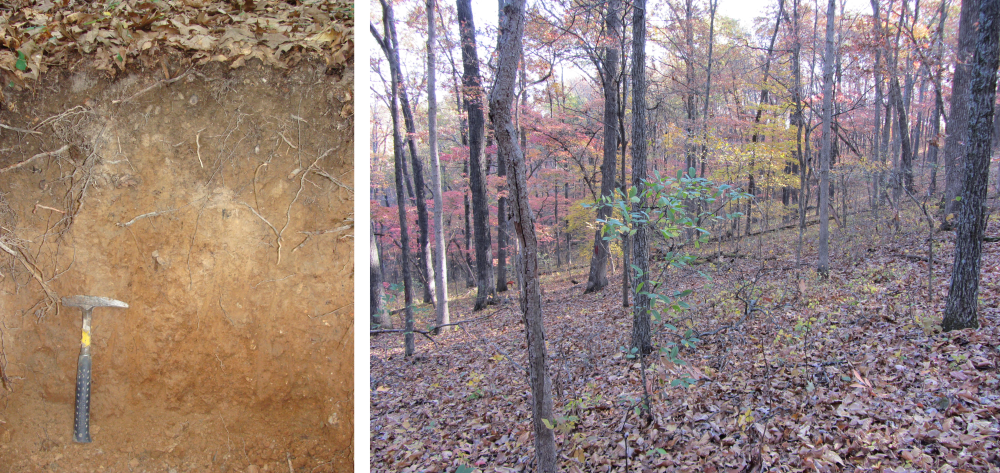

<!-- 800 words, excluding abstract -->
## Introduction

Articulate description of the interactions of soil properties and soil parent materials and how they connect to the larger surficial geologic deposits and stratigraphy through a geomorphic lens integrates soil survey information for use by the broader earth science community. Soil is the nexus between soil parent materials and surficial geologic deposits and comprises the dynamic interface between the biosphere and the lithosphere [@Wysocki_et_al_2005]. The overlapping domains of pedology and geomorphology within operational soil survey comprise a soil-landscape paradigm [@Hudson1992] foundation that strengthens soil survey methodology when put into practice.  A geopedologic approach applied to operational soil survey [@Zinck_geoped2016] further emphasizes the need for clear synthesis of soil parent material relationships to geomorphic concepts and the distillation of that information in soil survey products.  Data alone cannot support decisions, generate useful conclusions, or convey embedded relationships without thoughtful analysis and processing.  The wide-array of data sources, formats, and conventions (even within a single institution) can further complicate efforts to synthesize soil information from soil data sources.  Growth in promising tools that link database APIs, spatial data, and enable the analysis of complex soil description data are expanding the potential for soil science data analysis within programming environments like **R** [@R].

The Algorithms for Quantitative Pedology (AQP) project is a suite of packages for the **R** programming language that simplify most facets of soil data analysis. This project began in 2006 as a loosely-coordinated collection of **R** scripts used to support the management, analysis, and visualization of digital soil morphology records. By 2010 it became clear that an **R** package (code, manual pages, and example data following strict guidelines) hosted by CRAN would be the best route forward. The first version of the *aqp* package was submitted to CRAN in May of 2012; with a name and core functionality inspired by the concept of "quantitative pedology" [@Jenny1941Factors], analysis by regular depth-intervals [@harradine1963;@Moore1972], and the characterization of depth-functions [@meyers2011]. A companion article by @beaudette2013_AQP contained a detailed description and simple demonstrations of the main package features.

As functionality evolved, it was split into three main categories (i.e. **R** packages) to increase modularity and divide administrative tasks: *aqp* (soil-specific data structures, profile sketches, color conversion, pedotransfer functions, etc.), *soilDB* (wrapper and convenience functions for accessing APIs and harmonization of results), and *sharpshootR* (specialized tasks and visualizations designed for use with soil database connections provided by *soilDB* and data structures provided by *aqp*). Like most **R** packages, the AQP suite of packages depends on other packages for optimized computation [@data.table_pkg2021], color conversion  [@farver_pkg2021; @zeileis_colorspace_pkg2020], numerical classification [@cluster_pkg2021], methods for compositional data (e.g. sand, silt, and clay content) [@soiltexture_pkg2018; @compositions_pkg2021] to name a few. The authors hope that other scientists will find a suitable foundation in *aqp*, *soilDB*, and *sharpshootR*, upon which more specialized tools can be built, documented, and delivered in the form of new **R** packages.

Since 2011, the AQP suite of **R** packages has been extensively updated and documented by U.S. Department of Agriculture - Natural Resources Conservation Service (USDA-NRCS) Staff to support routine operations with the Soil and Plant Science Division. Some examples include aggregation and synthesis of field data to support initial soil survey (new mapping), graphical comparisons and correlation analysis to support soil survey update projects (refinement of existing mapping), and visual presentation of soil survey data to the public via tools like SoilWeb [@soilweb2017]. The *soilDB* package has become one of the most widely-used interfaces to USDA-NRCS data sources, with support for queries that accept (and return) mixtures of spatial and tabular data from the Soil Survey Geographic Database (SSURGO) [@ssurgo]. Spatial formats defined by the *sf* [@Pebesma2018_sf_pkg] and *raster* [@raster_pkg2021] **R** packages are used extensively by the *soilDB* package to minimize data conversion or pre-processing steps.


### Example Data: Clarksville Soil Series

```{r landscape-profile-photos, out.width='100%', fig.cap='Representative landscapes and Clarksville soil profile. Soil profile photo: Satchel Gaddie, landscape photo: Jayme LeBrun.'}

```

A curated set of soil morphologic and laboratory characterization data correlated to the Clarksville soil series (Loamy-skeletal, siliceous, semiactive, mesic Typic Paleudults) is used to demonstrate key functionality and visualization possibilities provided by the *aqp* suite of **R** packages. These data represent a very deep (> 150cm), somewhat excessively drained soil of large extent in the Ozark Highlands of southern Missouri, USA.  Clarksville soils are formed in residual and colluvial soil parent materials of cherty dolomite or cherty limestone [@kabrick_et_al_2008]. These soils typically occur on ridges and steep side slopes, spanning summit, shoulder, and backslope positions of an idealized 2D hillslope. Mean annual air temperature ranges from 13--15 degrees C, mean annual precipitation ranges from 1150--1250 mm, with most precipitation falling as rain. 

Soils are generally highly weathered, acidic with low to moderate base saturation, low cation exchange capacity and nutrient limiting for available phosphorus, calcium and magnesium [@kabrick_et_al_2011;@Singh_et_al_2015]. Morphology of Clarksville soils commonly include soil textures high in silt with thick accumulations of translocated clay at depth. Although soils are generally high in rock fragments, silt-rich soil textures dominate surface soil horizons due the influence of wind blown loess parent material. These landscapes support a mixed forest of black oak (*Q. velutina* Lam.), white oak (*Quercus alba* L.), blackjack oak (*Q. marilandica* Muench.), post oak (*Q. stellata* Wangenh.), shortleaf pine (*Pinus echinata* Mill.), black hickory (*Carya texana* Buckl.), red maple (*A. rubrum* L.), and dogwood (*Cornus florida* L.). 


