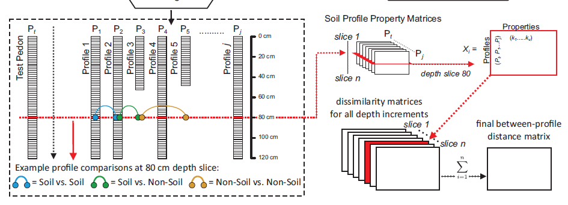
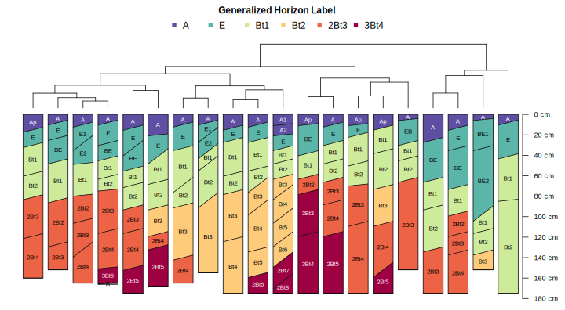
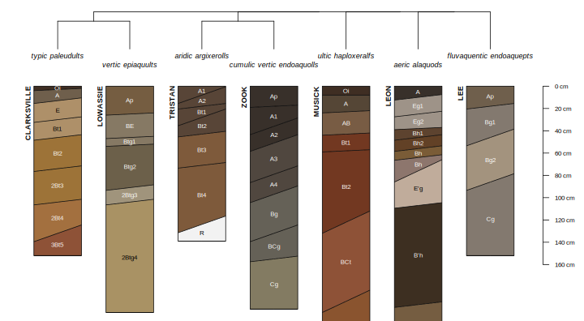
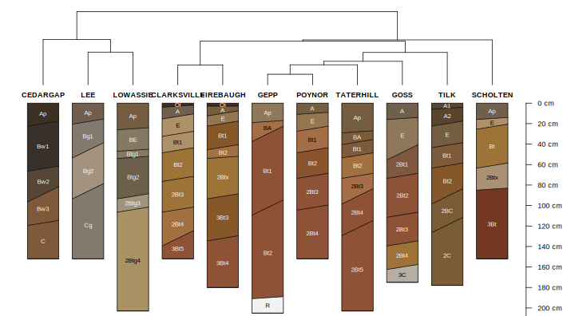

## Numerical Classification


```{r NCSP-outline-figure, out.width="100%", fig.cap="caption here. Figure c/o Jon Maynard."}

```

<!--
```{r genhz-dend-figure, out.width="100%", fig.cap="XXX"}

```
-->

```{r OSD-ST-dend-figure, out.width="100%", fig.cap="XXX"}

```


```{r OSD-ST-color-figure, out.width="100%", fig.cap="XXX"}

```


  * major concepts, cite / rely on two papers for details
  * genhz example
  * properties example

### Visualization

  * dendrogram + profiles
  * sharpshootR / soil taxonomy dendrogram figure
  * nMDS of profiles

original ideas [@Hole1960], [@Rayner1966], [@Moore1972], [@Carre2009], [@beaudette2013_AQP]

recent numerical classification paper [@Maynard_et_al_2020]


* `SoilTaxonomyDendrogram()`

