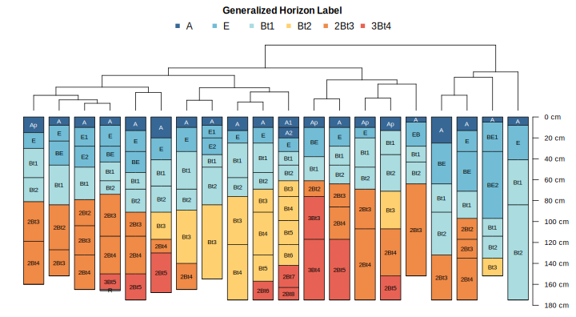
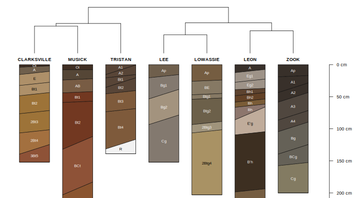

<!-- ~ 800 words -->
## Numerical Classification

Since the 1960's (likely corresponding with increased availability of computing hardware) there has been considerable interest in the development of numerical alternatives to traditional soil classification systems such as Soil Taxonomy [@SoilTaxonomy1999] and World Reference Base [@Chesworth2008]. 


A generalized, quantitative metric of similarity between soil profiles is complicated by the hierarchical nature of linked, site and horizon-level properties, sampling style (depth-intervals vs. genetic horizons), and subtle differences in horizon designation (through time, regionally, and even among co-workers). 


Our objective was to develop a set of data structures (classes) and associated algorithms (methods) that would support data-driven, quantitative evaluation of between-profile dissimilarity regardless of differences in horizon designation, thickness, or sampling style. 
[@beaudette2013_AQP; @Maynard_et_al_2020]

Pair-wise dissimilarities (between soil profiles) are evaluated along regular depth-slices using Gower's distance metric [@Gower1971], using any combination of continuous, categorical, or boolean attributes. Total pair-wise dissimilarity is computed by taking the sum of slice-wise dissimilarities, to a user-defined depth. Variation in profile depth is accounted for by assigning maximum slice-wise dissimilarity to comparisons between soil (e.g. Bt horizon) and non-soil (e.g. R horizon). The resulting dissimilarity matrix can be used to assist with topics ranging from initial mapping ("similar/dissimilar" soils), comparisons below family-level Soil Taxonomy, soil series correlation, map unit harmonization, and correlation between different taxonomic systems.


numerical taxonomy book: [@Sneath1973] 

[@Hole1960], [@Sarkar1966], [@Rayner1966], [@Moore1972], [@Carre2009], 


[@Arkley1976] [@Arkley1971]


```{r NCSP-outline-figure, out.width="100%", fig.cap="caption here. Figure c/o Jon Maynard."}
knitr::include_graphics('figures/NCSP-figure-Maynard-et-al.png')
```

<!--
```{r genhz-dend-figure, out.width="100%", fig.cap="XXX"}

```
-->

```{r OSD-ST-dend-figure, out.width="100%", fig.cap="XXX"}
knitr::include_graphics('figures/OSD-ST-dendrogram.svg')
```


```{r OSD-ST-color-figure, out.width="100%", fig.cap="XXX"}

```


  * major concepts, cite / rely on two papers for details
  * genhz example
  * properties example

### Visualization

  * dendrogram + profiles
  * sharpshootR / soil taxonomy dendrogram figure
  * nMDS of profiles

original ideas 


chapter 4 from Geopedology book
