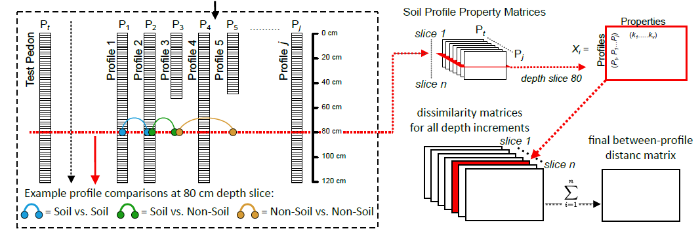

<!-- ~ 800 words -->
## Numerical Classification of Soils

Since the 1960's (likely corresponding with increased availability of computing hardware) there has been considerable interest in the development of numerical alternatives to traditional soil classification systems such as Soil Taxonomy [@SoilTaxonomy1999] and World Reference Base [@Chesworth2008]. A "numerical taxonomy" [@Sneath1973] of soil horizons or collections of horizons (i.e. soil profiles or aggregation thereof) relies on a deliberate selection of characteristics (soil properties), distance metric (e.g. Euclidean), and criteria used to identify clusters (e.g. hierarchical vs. partitioning methods) [@Arkley1976]. Selection of characteristics is complex; a limited set of soil properties cannot universally describe differences between individuals, and the use of all measurable properties is unfeasible--a selection must be made prior to analysis [@Sarkar1966; @Arkley1971]. Furthermore, a generalized approach to the numerical classification of soil profiles (as a whole) is complicated by the hierarchical nature of linked, site and horizon-level properties, sampling style (depth-intervals vs. genetic horizons), and subtle differences in horizon designation (through time, regionally, and even among co-workers). Despite the many challenges, there have been many successful applications of numerical taxonomy to soil science and soil classification [@Hole1960; @Rayner1966; @Moore1972; @Dale1989; @Carre2009].

```{r NCSP-outline-figure, out.width="100%", fig.cap="Graphical outline of the NCSP algorithm. Figure c/o Jon Maynard, adapted from @Maynard_et_al_2020."}

```

<!-- note that we are using the new name here -->
The NCSP (Numerical Comparison of Soil Profiles) algorithm, implemented in the *aqp* package for *R*, attempts to address many of the long-standing difficulties with a numerical classification of entire soil profiles [@beaudette2013_AQP; @Maynard_et_al_2020]. Building on methods suggested by @Moore1972, pair-wise distance (between soil profiles) are evaluated along regular depth-slices using Gower's distance metric [@Gower1971], using any combination of continuous, categorical, or boolean attributes (Figure \@ref(fig:NCSP-outline-figure)). Total pair-wise dissimilarity is computed by taking the sum of slice-wise dissimilarities, to a user-defined depth. Variation in profile depth is accounted for by assigning maximum slice-wise dissimilarity to comparisons between soil (e.g. Bt horizon) and non-soil (e.g. R horizon). Further customization of the NCSP algorithm is described in @beaudette2013_AQP. The resulting dissimilarity matrix can be used to assist with topics ranging from initial mapping ("similar/dissimilar" soils), comparisons below family-level Soil Taxonomy, soil series correlation, map unit harmonization, and correlation between different taxonomic systems.


```{r genhz-dend-figure, out.width="100%", fig.cap="Soil profile sketches from Figure 7, arranged according to divisive hierarchical clustering of the distance matrix generated by the NCSP algorithm."}
knitr::include_graphics('figures/genhz-dendrogram.svg')
```

Applied to the same set of soil profiles highlighted in Figure \@ref(fig:GHL-figure), the NCSP algorithm was used to generate a distance matrix using only the GHL classes (ordinal values) to a depth of 175cm (Figure \@ref(fig:genhz-dend-figure)). A dendrogram was created from the distance matrix via divisive hierarchical clustering [@Kaufman2005], and combined with profiles sketches with the `plotProfileDendrogram()` function from the `sharpshootR` package (Figure \@ref(fig:genhz-dend-figure)). Profiles with similar GHL assignments, occurring at similar depths, are allocated to clusters defined by branching near the bottom of the dendrogram (Figure \@ref(fig:genhz-dend-figure)). When a combination of site (e.g. slope, drainge class, geoform, etc.) and horizon-level properties are requested, the final distance matrix is developed from a weighted average of the site and horizon-level distance matrices. Pair-wise distances between soil profiles can be difficult to interpret when a large number of properties are included in the calculation, and may require a different approach to thematic coloring of profile sketches such as principal component (i.e. principal component analysis of the property matrix) or principal coordinate (i.e. principal coordinate analysis of the distance matrix) scores. An alternative presentation of the data is possible by arranging profile sketches (with `plotSPC()`) according to the new axes created by 2-dimensional ordination, typically via non-Metric Multidimensional Scaling (nMDS) of the distance matrix.


<!-- sharpshootR: hang profiles from dendrogram -->

<!-- cite / link to chapter 4 from Geopedology book -->


 <!-- add a SoilTaxonomyDendrogram() plot similar to the output in Zinck, chapter 4 -->


<!-- ```{r OSD-ST-dend-figure, out.width="100%", fig.cap="XXX"} -->
<!--  -->
<!-- ``` -->


<!-- ```{r OSD-ST-color-figure, out.width="100%", fig.cap="XXX"} -->
<!-- knitr::include_graphics('figures/OSD-soil-color-dendrogram.svg') -->
<!-- ``` -->


<!--   * major concepts, cite / rely on two papers for details -->
<!--   * genhz example -->
<!--   * properties example -->

<!-- ### Visualization -->

<!--   * dendrogram + profiles -->
<!--   * sharpshootR / soil taxonomy dendrogram figure -->
<!--   * nMDS of profiles -->

<!-- original ideas  -->


