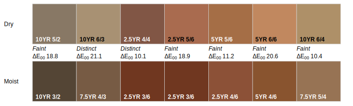
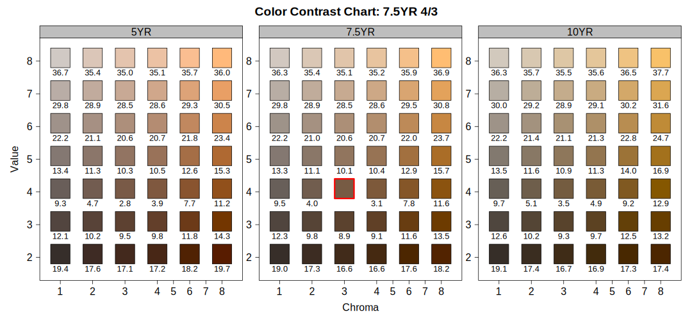

<!-- 2000 words -->
## Soil Morphology

The field description of a soil profile (genetic horizon depths, boundaries, color, soil texture, rock fragment volume, structure, etc.) is typically the foundation upon which additional sampling, laboratory characterization, or soil survey are based. In aggregate, a complete collection of horizons, associated properties, and landscape context (e.g. catenary position or other geomorphic description) represent an atomic unit of pedologic inquiry: the pedon [@SoilSurveyManual2017]. The AQP family of R packages and the `SoilProfileCollection` datatype were designed specifically to elevate the pedon (and collections of pedons) to a convenient abstraction (an object), enabling a simpler interface to what would otherwise be a complex hierarchy of above and below-ground records. In *aqp*, The more generic term "profile" is used instead of pedon to accommodate incomplete data (missing above-ground information) or otherwise truncated (e.g. 0-25cm) observations. Central to this approach are the specification of profile IDs and horizon depths, above-ground ("site") vs. below-ground ("horizon") attributes, and ideally horizon designation and soil color.


### Soil Color
The color of soil material observed during field investigations is one of the most striking and useful properties recorded as part of a soil profile description. Typically recorded in the Munsell system [@Munsell1947; @Simonson1993; @SoilSurveyManual2017] in the form of "hue value/chroma", the three components of this notation provide interpretive suggestions about iron oxides and oxidation state (hue and chroma) [@Schwertmann1993; @Scheinost1999], soil carbon (value) [@Wills2007; @Liles2013], as well as hints about the relative importance of catenary relationships [@Brown2004].

<!-- 2-3 sentences max -->
Several color-based metrics of soil development [@Buntley1965; @harden1982], rubification [@barron1986; @hurst1997], and melanization [@harden1982; @thompson1996] are implemented in the *aqp* package.


#### Color Conversion

The *aqp* package provides several interfaces for conversion between Munsell notation and sRGB or CIELAB color spaces, largely based on the 1943 Munsell renotation table [@centore2012]. Forward conversion from standard Munsell notation (e.g. 10YR 3/4) is performed via look-up table, derived from the renotation data and interpolated to include odd chroma values. The function `munsell2rgb()` performs a direct transformation to sRGB-encoded colors in hexadecimal (#5E4323), sRGB coordinates scaled to the interval of 0--1 ([0.36791, 0.26445, 0.13648]), or CIELAB coordinates ([30.807, 7.357, 24.027]) [@beaudette2013_AQP]. Inverse transformation from sRGB coordinates is performed by the `rgb2munsell()` function; approximated by nearest-neighbor search of the Munsell-sRGB look-up table using the CIE2000 color contrast metric [@farver_pkg2021]. All color space coordinates are referenced to the CIE standard illuminant D65, which is a close approximation to average midday sunlight in the northern hemisphere [@Marcus1998]. sRGB and CIELAB color spaces were selected to address two common uses of soil color: sRGB, due to the its use in most all computer graphics applications, and CIELAB for the convenient alignment of axes and common pigments in the soil environment [@Rossel_et_al_2006; @Liles2013]. 

Non-standard notation of Munsell colors (e.g. 10.6YR 3.3/5.5), as collected by digital colorimeter, can be converted to approximate sRGB coordinates using the `getClosestMunsellChip()` function. However, this approach uses rounding of value and chroma and snapping to the nearest standard hue (10YR). Exact conversion of non-standard Munsell notation can be performed using the *munsellinterpol* R package [@munsellinterpol_pkg2021].


#### Color Contrast

Color contrast (perceptual difference between two colors) within a soil sample is an important component of field-described redoximorphic features, concentrations, and mottles [@FieldBookv3]. Soil Survey products and wetland delineation protocols adopted by the National Cooperative Soil Survey (NCSS) currently use *contrast classes* (faint, distinct, and prominent) to describe color contrast, based on differences in Munsell hue, value, and chroma [@SSTN2]. The `colorContrast()` function in *aqp* computes differences in Munsell {hue, value, chroma}, soil color contrast class, and the CIE2000 color contrast metric [@Sharma2005] for pairs of colors specified in Munsell notation. The function is fully vectorized meaning that multiple comparisons can be generated without explicit looping (Table \@ref(tab:color-contrast-table)).

```{r color-contrast-table, echo = FALSE}
library(aqp)
cc <- colorContrast(c('10YR 3/3', '7.5YR 6/6', '2.5Y 2/2'), c('10YR 3/4', '5YR 4/6', '5G 4/8'))
names(cc) <- c('Color 1', 'Color 2', 'dH', 'dV', 'dC', 'dE00', 'CC')

knitr::kable(cc, digits = 1, align = 'c', caption = 'Output includes: change in hue (dH), change in value (dV), change in chroma (dC), CIE2000 color contrast (dE00), and NCSS soil color contrast class (CC).')
```

Tabular color contrast output can be convenient when used as an intermediate step in a more complex workflow, but can be difficult for non-specialists to interpret. A graphical representation of these data are created by the `colorContrastPlot()` function provided by *aqp*. For example, the differences between typical dry and moist soil colors for the Musick soil series are demonstrated using (Figure \@ref(fig:contrast-class-figure)). While exact replication of Munsell colors isn't possible on un-calibrated displays or printers, the sRGB approximation is sufficient to demonstrate relative differences in hue, value, and chroma.

```{r contrast-class-figure, fig.cap="caption here"}

```

To further aid with the calculation and interpretation of color contrast, "color contrast charts" can be created with the `contrastChart()` function provided by *aqp*. These charts are based on a source color in Munsell notation (e.g. 7.5YR 4/3) and select pages of Munsell hue. Pair-wise metrics of color contrast are evaluated between all color "chips" and the source color (outlined in red), and arranged in a familiar format with Munsell chroma on the x-axis, value on the y-axis, and pages of hue split across panels. Soil color contrast class and CIE2000 values are printed below each color "chip" (Figure \@ref(fig:contrast-chart-figure)).

```{r contrast-chart-figure, fig.cap="Color contrast chart for 7.5YR 4/3, including reference 5YR, 7.5YR, and 10YR hue pages. Soil color contrast classes are abbreviated as F (faint), D (distinct), and P (prominent). Numbers are CIE2000 values."}

```


#### Simulated Color Mixtures


color measurement, standard observers, mixtures [@Marcus1998]

<!-- https://www.munsellcolourscienceforpainters.com/ColourSciencePapers/OpenSourceInverseRenotationArticle.pdf -->
Paul Centore's work [@centore2012]


`mixMunsell()`

`plotColorMixture()`

`colorMixtureVenn()`


`data("soil_minerals")`


### Genetic / Generalized Horizons

 * generalized horizon labels: why / how (Jay) see "functional horizons" in [@Wagenet1991]
 * `depthOf()` family of functions (Andrew)
 * thickness, soil depth estimation (Dylan, Andrew)

Soil scientists use a common language of horizon designation nomenclature to describe and articulate the differences they observe in soil horizons within a soil pedon.  These basic notations and the act of 'naming' genetic horizons distills important information in the form of master horizons, characteristic subscripts, horizon and pedogenic sequences and parent material discontinuities.  Horizon designations convey a mental concept of the soil properties while allowing complexity and variability in how horizon designations are applied.  Experienced soil scientists will generally apply horizon nomenclature similarly to the features they observe and identify in the process of describing a soil profile due to the rigid guidelines and definitions of their application.  Building on these similarities of horizon usage is a concept called, Generalized Horizon Labels (GHL) which seeks to unify a similar yet diverse set of soil profile horizonations for the purpose of aggregation, analysis, and summary operations[@Beaudette2015; @Roecker2015].  The process of applying GHL to a collection of soil profiles is a series of micro-correlations made by a soil scientist to determine which horizons have similar soil morphology and properties to be grouped together for aggregation across horizons within a soil profile collection.  The aggregations into GHL provide a way to convey functional horizons for collections of soil profiles, such summary concepts can be extended to pedotransfer functions [@Wagenet1991].

The application of GHL to soil profile collections within the AQP package is driven by Regular Expression (REGEX) pattern matching.  REGEX provides a powerful means of controlling and applying alpha-numeric string matching of horizonation sequences to 'collect' numerous varied horizon designation sequences into a set of unified horizon designations. A user developed set of REGEX rules are matched to an identified vector of horizonation by the `generalize.hz()` function in the AQP package.  

<!-- ISSUE with profile 8 in figure below, horizonation jumps from Bt1 to Bt3??? Profile 9 has Bt2 and Bt3, but no Bt1??? Need to make sure we look these over carefully!!! -->

```{r sketch-demo-figure, fig.cap="Here a series of GHL have been applied to a collection of soil profiles of the Clarksville soil series from the Ozark Highlands, Missouri.  Horizon labels within each soil profile show the original horizon designations while colors indicate the GHL each horizon was mapped to using a set of REGEX rules."}
knitr::include_graphics('figures/sketch-demo.svg')
```


Features unique to the Clarksville soil series are argillic diagnostic horizons and parent material discontinuities as horizons transition along boundaries between cherty dolomite slope alluvium and colluvium over dolomite residuum. GHL can be used to identify these common features in a set of soils once applied.

The `depthOf()` family of functions utilize REGEX pattern matching to specific horizon designation to calculate the depth of occurrence of that horizon designation within a collection of profiles.  Given a set of Clarksville soil series profiles a `minDepthOf()` and `maxDepthOf()` provide additional utility to find either the top (shallowest) or bottom (deepest) depth to a matching horizon pattern ('Bt' in example shown in figure ?).  Once derived for a set of profiles they can be ordered according to the depth to the specified feature.  These functions provide convenience handling for missing values or when target patterns are not found within a profile.  Results are returned as a numeric vector for single profiles or a  `data.frame` of results with profile ID, horizon ID, top or bottome depths, horizon designation and pattern provided.

<!-- TODO: sort figure above with use of depthOf() to top of 'Bt' to highlight use in ordering profiles and these operations. Include explanation in the figure caption. -->
 

### Sketches

<!-- possible figure, highlighting several aspects of plotSPC -->


<!-- https://casoilresource.lawr.ucdavis.edu/soil_web/list_components.php?mukey=2501629 -->


```{r catena-sketches, fig.cap="Illustration of the catena concepts for soil components from two adjacent mapunits within the Ozark Highlands.  Soil components (retrieved via `fetchSDA()` within map unit 2vxq8 occur on summit and shoulder hillslope profile positions while components in map unit 2vxq9 occur on backslope, footslope and toeslope positions.  USDA soil texture classes used as colors to fill the soil profiles show the variation of textures within the catena.  Munsell soil colors retrieved via `fetchOSD()` are shown in the narrower companion profiles for each component."}
knitr::include_graphics('figures/cross-section.svg')
```


  * `plotSPC()`
  * annotation
  * other profile plotting functions
  * horizon boundaries
  * future work (grid graphics, pattern fill)
  


<!-- other ideas -->

<!-- data quality / analysis [@Roecker2016] and DSMorph [@Beaudette_DSMorph2016] -->


 <!-- * misc. visualization methods (via `sharpshootR`) (Jay) -->
 
 
 <!-- * `aggregateColorPlot()` -->
 <!-- * `aspect.plot()` -->
 <!-- * `huePositionPlot()` -->
 <!-- * `plotProfileDendrogram()` -->
 <!-- * `plotSoilRelationGraph()` -->
 <!-- * `plotWB()` -->
 
 <!-- * `plotTransect()` -->
 <!-- * `vizHillslopePosition()` and related -->

 
 
 
 
 
 
 
 

