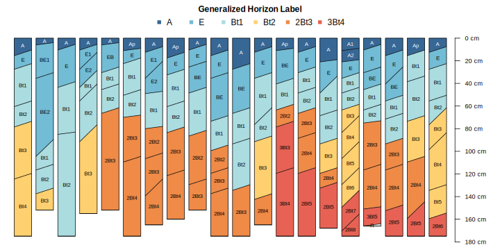

---
output:
  html_document:
    fig_caption: yes
    number_sections: yes
    theme: journal
  pdf_document:
    fig_caption: yes
  word_document:
    fig_caption: yes
bibliography: bibliography.bib
---

<!-- 2000 words -->
# Soil Morphology

The field description of a soil profile (genetic horizon depths, boundaries, color, soil texture, rock fragment volume, structure, etc.) is typically the foundation upon which additional sampling, laboratory characterization, or soil survey are based. In aggregate, a complete collection of horizons, associated properties, and landscape context (e.g. catenary position or other geomorphic description) represent an atomic unit of pedologic inquiry: the pedon (*citation*). The AQP family of R packages and the `SoilProfileCollection` datatype were designed specifically to elevate the pedon (and collections of pedons) to a convenient abstraction (an object), enabling a simpler interface to what would otherwise be a complex hierarchy of above and below-ground records. In *aqp*, The more generic term "profile" is used instead of pedon to accommodate incomplete data (missing above-ground information) or otherwise truncated (e.g. 0-25cm) observations. Central to this approach are the specification of profile IDs and horizon depths, above-ground ("site") vs. below-ground ("horizon") attributes, and ideally horizon designation and soil color.

  <!-- data quality / analysis [@Roecker2016] and DSMorph [@Beaudette_DSMorph2016] -->

## Soil Color
The color of soil material observed during field investigations is one of the most striking and useful properties recorded as part of a soil profile description. Typically recorded in the Munsell system [@Munsell1947; @Simonson1993; @SoilSurveyManual2017] in the form of "hue value/chroma", the three components of this notation provide interpretive suggestions about iron oxides and oxidation state (hue and chroma) [@Schwertmann1993; @Scheinost1999], soil carbon (value) [@Wills2007; @Liles2013], as well as hints about the relative importance of catenary relationships [@Brown2004].

<!-- 2-3 sentences max -->
Several color-based metrics of soil development [@Buntley1965; @harden1982], rubification [@barron1986; @hurst1997], and melanization [@harden1982; @thompson1996] are implemented in the *aqp* package.

### Color Conversion

The *aqp* package provides several interfaces for conversion between Munsell notation and sRGB or CIELAB color spaces, largely based on the 1943 Munsell renotation table [@centore2012]. Forward conversion from standard Munsell notation (e.g. 10YR 3/4) is performed via look-up table, derived from the renotation data and interpolated to include odd chroma values. The function `munsell2rgb()` performs a direct transformation to sRGB-encoded colors in hexadecimal (#5E4323), sRGB coordinates scaled to the interval of 0--1 ([0.36791, 0.26445, 0.13648]), or CIELAB coordinates ([30.807, 7.357, 24.027]) [@beaudette2013_AQP]. Inverse transformation from sRGB coordinates is performed by the `rgb2munsell()` function; approximated by nearest-neighbor search of the Munsell-sRGB look-up table using the CIE2000 color contrast metric [@farver_pkg2021]. All color space coordinates are referenced to the CIE standard illuminant D65, which is a close approximation to average midday sunlight in the northern hemisphere [@Marcus1998]. sRGB and CIELAB color spaces were selected to address two common uses of soil color: sRGB, due to the its use in most all computer graphics applications, and CIELAB for the convenient alignment of axes and common pigments in the soil environment [@Rossel_et_al_2006; @Liles2013]. 

<!-- possibly talk about non-standard notation, munsellinterpol package and Paul's work  -->
`getClosestMunsellChip('10.6YR 3.3/5.5', convertColors = FALSE)`

<!-- pantone system ? -->
`PMS2Munsell()`

<!-- think about included data sets and if we have space here i.e. `soil_minerals` -->

### Color Contrast and Variability

<!-- https://www.nrcs.usda.gov/wps/portal/nrcs/detail/soils/ref/?cid=nrcs142p2_053569 -->

`colorContrast()`

`colorContrastPlot()`

`contrastChart()`

### Color Variability

<!-- describing a range in soil color (Dylan) -->

`aggregateColor()`

`colorQuantiles()`

### Simulated Color Mixtures

color measurement, standard observers, mixtures [@Marcus1998]

<!-- https://www.munsellcolourscienceforpainters.com/ColourSciencePapers/OpenSourceInverseRenotationArticle.pdf -->
Paul Centore's work [@centore2012]

`mixMunsell()`

`plotColorMixture()`

`colorMixtureVenn()`

`data("soil_minerals")`

## Genetic / Generalized Horizons
 * generalized horizon labels: why / how (Jay) see "functional horizons" in [@Wagenet1991]
 * horizon boundaries
 * regular expressions used to "find" contact etc. (Andrew, Stephen)
 * thickness, soil depth estimation (Stephen)
 * `depthOf()` family of functions (Andrew)

## Sketches

<!-- possible figure, highlighting several aspects of plotSPC -->

  * `plotSPC()`
  * annotation
  * other profile plotting functions
  * future work (grid graphics, pattern fill)
  

## Misc.

 * misc. visualization methods (via `sharpshootR`) (Jay)
 
 
 * `aggregateColorPlot()`
 * `aspect.plot()`
 * `colorMixtureVenn()`
 * `diagnosticPropertyPlot()`
 * `huePositionPlot()`
 * `plotProfileDendrogram()`
 * `plotSoilRelationGraph()`
 * `plotWB()`
 * `SoilTaxonomyDendrogram()`
 * `plotTransect()`
 * `vizHillslopePosition()` and related
 * `colorChart()`
 * `huePosition()`

 
 
 
 
 
 
 
 

