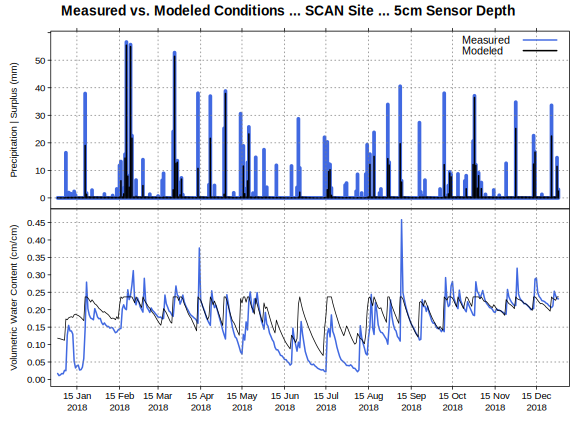

## Water Balance
  
As a state factor in understanding soil formation, climate and the interactions and timing of moisture and temperature, have long held a pivotal role in describing site dynamics at local and regional scales. Thornthwaite developed the first water balance model accounting for inputs of precipitation and losses to evapotranspiration [@Thornthwaite1948]. Water balance metrics relate to soil storage and the downward and upward flux of water through soil and associated soil property development as the soil acts as a sponge responding to atmospheric supply and demand [@Arkley_Ulrich1962].  Correlation of water balance metrics to vegetation growth at sites has become an important tool for the study of site conditions related to existing vegetation distribution [@Stephenson1998;@Lutz_et_al2010]and forecasting site climate trajectories.  High quality and widely accessible gridded climate data has increased the use soil water balance models as a valuable tool for exploring the nuances of climate at a given point on the landscape.   

```{r water-balance-figure, fig.cap="Comparison of annual water balance metrics (VWC and Precipitation) for 2018 at SCAN station 2194 in the Ozark Highlands."}

```

The `sharpshootR` package provides methods (via dependencies on the *elevatr*, *daymetr*, *Evapotranspiration*, and *hyrdomad* packages) for calculating water balance variables of precipitation (PPT), potential evapotranspiration (PET), actual evapotranspiration (AET), deficit(D), soil moisture storage (S), surplus (U), volumetric water content (VWC) on a monthly `monthlyWB()` and daily `dailyWB()` time steps.  Convenience functions such as `prepareDailyClimateData()` assemble the available water-holding capacity (AWC) values derived for major components in soil map units of the US Soil Survey for specific point coordinates, gridded DAYMET climate data[@DAYMET] is then downloaded for the specified location and daily water balance metrics are estimated via `dailyWB_SSURGO()`.  

The *soilDB* package provides query access to the station data in the USDA-NRCS Soil Climate Analysis Network (SCAN).  These stations provide above and below ground climate sensor networks that measure soil temperature, soil moisture, air temperature and precipitation.  Most stations have associated laboratory data in the Kellogg Soil Survey Laboratory (KSSL) system.  The data in figure 11 is assembled through separate calls to `fetchSCAN()` for the SCAN climate station data and `dailyWB_SSURGO()` which derives AWC for the Scholten soil component, assembles DAYMET data for the SCAN station location and runs a daily water balance model.  Comparisons of modeled and measured values allow for evaluation of water balance model utility and function.


